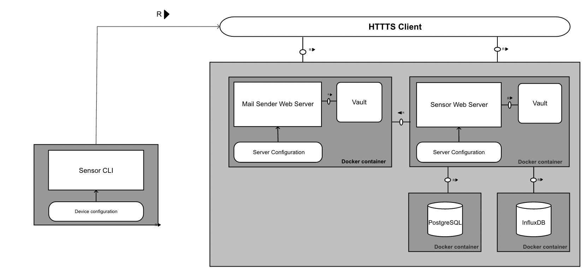

# Sensor API for monitoring system

## Architecture



## Deployment

1. Generate root CA

```
    ./tls.sh generate --generationType CA  --certDir ./cfg/tls/sec --caKeyPem rootCAkey.pem --caCertPem rootCACert.pem --caDuration 3650

```

2. Generate signed by the CA certificates for the sensor API

```
  ./tls.sh generate --generationType cert --certDir ./cfg/tls/sec --caKeyPem rootCAkey.pem --caCertPem rootCACert.pem --certDuration 365 --CN localhost --C BG --L Sofia --O TT --OU system --SAN DNS:localhost,DNS:sensorapi --certRequestFile sensorapiCert.csr --certPem sensorapiCert.pem --certKeyPem sensorapiKey.pem

```


3. Generate signed by the CA certificates for the mail sender API

```
  ./tls.sh generate --generationType cert --certDir ./cfg/tls/sec --caKeyPem rootCAkey.pem --caCertPem rootCACert.pem --certDuration 365 --CN localhost --C BG --L Sofia --O TT --OU system --SAN DNS:localhost,DNS:mailSender --certRequestFile mailSenderCert.csr --certPem mailSenderCert.pem --certKeyPem mailSenderKey.pem

```

4. Create approriate servers configuration

- Example for the sensor API server configuration:

```
vaultType: plain
services:
  influxdb:
    databaseName: sensorCLI
    # The token is retrieved from vault
    tokenSecret: influxToken
    serviceName: influxdb
    org: org
    bucket: bucket
    port: "8086"
  postgresdb:
    databaseName: sensorCLI
    # The secret is retrieved from vault
    passwordSecret: postgreSecret
    serviceName: postgredb
    sslmode: disable
    port: "5432"
  mailsender:
    serviceName: mailsender
    port: "8083"
security:
  authentication:
    JWT:
      jwtAudienceSecret: audSecret
      jwtIssuerSecret: issSecret
      jwtSigningKey: signingKey
      expirationTime: 1h
  #If tls configuration is not provided HTTP server communication is configured
  tls:
    #The cert file is read from ./cfg/tls directly.
    #If the certificate is signed by a certificate authority,
    #the certFile should be the concatenation of the server's certificate,
    #any intermediates, and the CA's certificate.
    certFile: serverCert.pem
    #The matching for the certificate private key.
    privateKey: serverKey.pem
    rootCACert: rootCACert.pem
    rootCAKey: rootCAKey.pem
user:
  userSecret: "userSecret"
  firstname: "Todor"
  lastname": "Todorov"
  email: "todor.mtodorov01@gmail.com"
```

- Example for the mailsender server configuration
```
vaultType: plain
SMTPServerCfg:
  host: smtp.gmail.com
  port: 587
  passwordSecret: passwordSecret
  keepAlive: true
  connectionTimeout: 30s
  sendTimeout: 30s
security:
  #If tls configuration is not provided HTTP server communication is configured
  tls:
    #The cert file is read from ./cfg/tls directly.
    #If the certificate is signed by a certificate authority,
    #the certFile should be the concatenation of the server's certificate,
    #any intermediates, and the CA's certificate.
    certFile: mailSenderCert.pem
    #The matching for the certificate private key.
    privateKey: mailSenderKey.pem
    rootCACert: rootCACert.pem
    rootCAKey: rootCAKey.pem
```

- All neccessary secrets in the servers configuration files are retrieved from vault
    - Currently only plain vault in YAML format is supported
        - Example:
        ```
        - id: <secretID>
          name: <name>
          value: <value>
        ```
5. Configure your docker-compose file using the appropriate mounts for the server configurations

```
version: '3.8'
services:
  influxdb:
    image: todorov99/sensorapi-influx:1.0.0
    container_name: "<containerName>"
    ports: 
      - '8086:8086'
  postgredb:
    image: todorov99/sensorapi-postgre:1.0.0
    container_name: "<containerName>"
    ports:
      - '5432:5432'
  mailsender:
    image: todorov99/mailsender:1.0.2
    container_name: "<containerName>"
    volumes:
      - <pathToTheCfgDirectory>:/mailsender/cfg
    environment:
      - PORT=8083
    ports:
      - "8083:8083"
  sensorapi:
    image: todorov99/sensorapi:1.0.0
    container_name: "<containerName>"
    volumes:
      - <pathToTheCfgDirectory>:/sensorapi/cfg
    environment:
      - PORT=8081
    depends_on:
      - 'influxdb'  
      - 'postgredb'
      - 'mailsender'
    ports:
      - '8081:8081'
```

- Example:

```
version: '3.8'
services:
  influxdb:
    image: todorov99/sensorapi-influx:1.0.0
    container_name: "sensorapi-influx-bachelor"
    ports: 
      - '8086:8086'
  postgredb:
    image: todorov99/sensorapi-postgre:1.0.0
    container_name: "sensorapi-postgre-bachelor"
    ports:
      - '5432:5432'
  mailsender:
    image: todorov99/mailsender:1.0.2
    container_name: "mailsender-bachelor"
    volumes:
      - /Users/t.todorov/Develop/mailsender/cfg:/mailsender/cfg
    environment:
      - PORT=8083
    ports:
      - "8083:8083"
  sensorapi:
    image: todorov99/sensorapi:1.0.0
    container_name: "sensorapi-bachelor"
    volumes:
      - /Users/t.todorov/Develop/server/cfg:/sensorapi/cfg
    environment:
      - PORT=8081
    depends_on:
      - 'influxdb'  
      - 'postgredb'
      - 'mailsender'
    ports:
      - '8081:8081'
```

### Start postres database for local development

1. Build the docker image for postgredb (./pkg/database)

```
    docker build -t <image>:<tag> <dockerFilePath>
```

2. Run PostresDB:
```
    docker run --publish 5432:5432  <image>
```

2. Start PgAdmin

```
   docker run --rm -p 5050:5050 thajeztah/pgadmin4
```

If the IP is not published and can be accessed from outside you should get the internal IP by running:

```
docker inspect <containerID>
```

- Access to pgAdmin from the browser http://localhost:5050 (The port is that specified with -p flag in docker run command)
